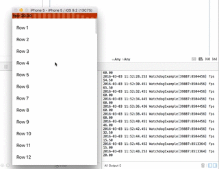

# WatchdogInspector
#### Shows your current framerate (fps) in the status bar of your iOS app
##### Be a good citizen! Don't block your main thread!
[](https://travis-ci.org/tapwork/WatchdogInspector)
[](https://github.com/tapwork/WatchdogInspector/blob/master/WatchdogInspector.podspec)
[](https://github.com/tapwork/WatchdogInspector/blob/master/LICENSE)
[]()

WatchdogInspector counts your app's framerate and displays the fps in the status bar.
The coloured status bar lets you know when your framerate drops below 60 fps.
If everything is fine your status bar gets happy and will stay green.
To detect unwanted main thread stalls you can set a custom watchdog timeout.

## Features
* Status bar displays the current framerate in fps (measured every 2 seconds)
* Colours the status bar from green (good fps) to red (bad fps)
* Custom watchdog timeout: Exception when main thread stalls for a defined time



## Usage
Install via CocoaPods
```
pod "WatchdogInspector"
```
and run `pod install`
You can see the example project how to setup and run `WatchdogInspector`
Make sure that you **don't** use `WatchdogInspector` in production.

##### Objective-C  |  [Swift](README_SWIFT.md)
Start `WatchdogInspector` after launch or whenever you want.
```Objective-C
#import <WatchdogInspector/TWWatchdogInspector.h>
- (BOOL)application:(UIApplication *)application didFinishLaunchingWithOptions:(NSDictionary *)launchOptions {
    [TWWatchdogInspector start];
    return YES;
}
```
To stop it just call
```Objective-C
[TWWatchdogInspector stop]
```
You can set a custom watchdog timeout by calling (Default: 3 seconds)
```Objective-C
[TWWatchdogInspector setStallingThreshhold:10.0];
```
To log all measured framerates you can log them in the console by calling (Default: on)
```Objective-C
[TWWatchdogInspector setUseLogs:YES];
```

## How it works
There are basically two timers running to measure the framerate.
1. A background timer that fires every 2 seconds to count the frames set by the main thread.
The background timer resets the frames counter every event and sends the measured fps to the status bar on the main thread.
2. A main thread timer that fires every 1/60 second (60 fps is optimum for a smooth animation) The main thread timer increments the frames counter every timer event.

There is also a run loop observer running to detect main thread stalls for a defined timeout. If the timeout has been reached an exception will be thrown.

## Related projects
* [HeapInspector](https://github.com/tapwork/HeapInspector-for-iOS)
Find memory issues & leaks in your iOS app

## Author
* [Christian Menschel](http://github.com/tapwork) ([@cmenschel](https://twitter.com/cmenschel))

## License
[MIT](LICENSE)
